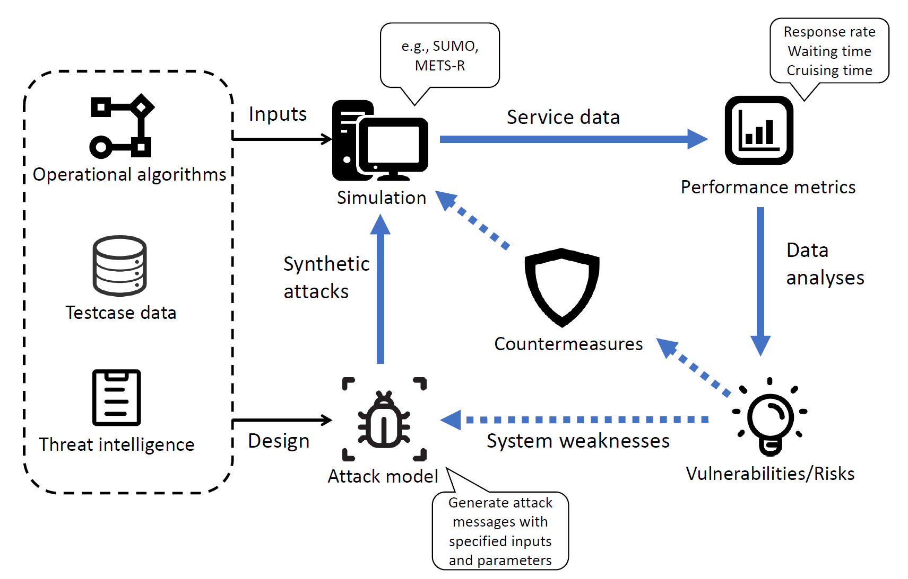

# On the cyber risks in AMoD (Autonomous Mobility on Demand) services

This is an implementation of the following framework for assessing the adverse impacts caused by potential cyber-attacks in an AMoD system.
 
